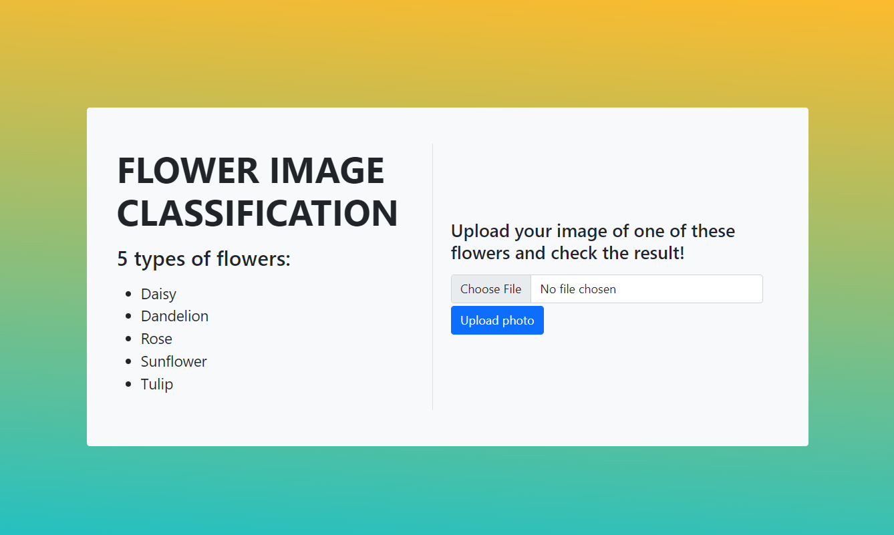
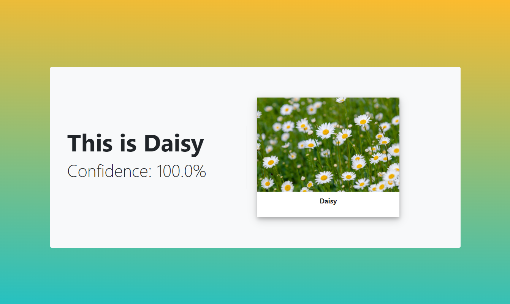
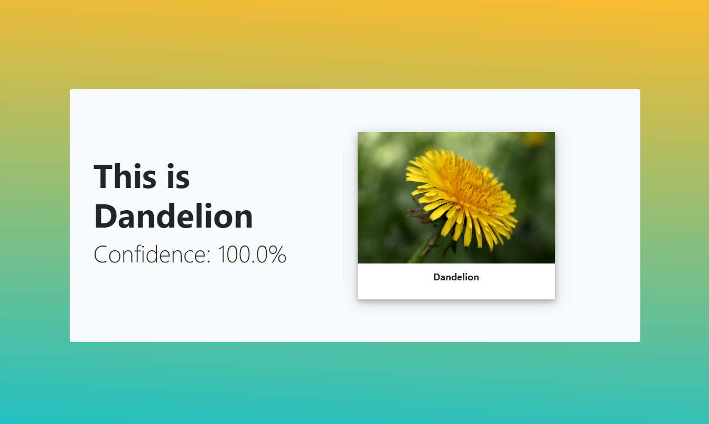
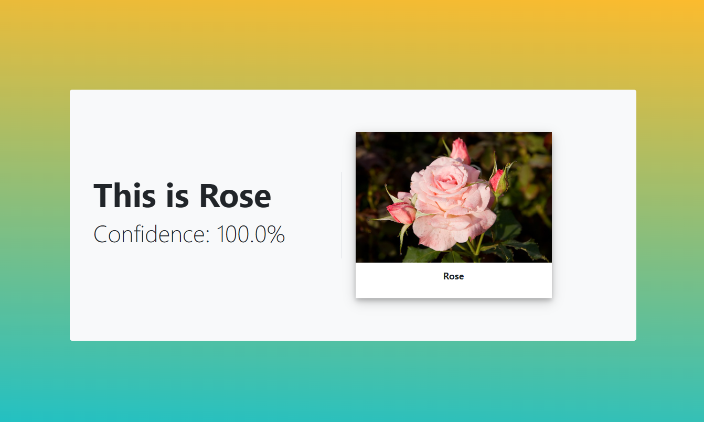
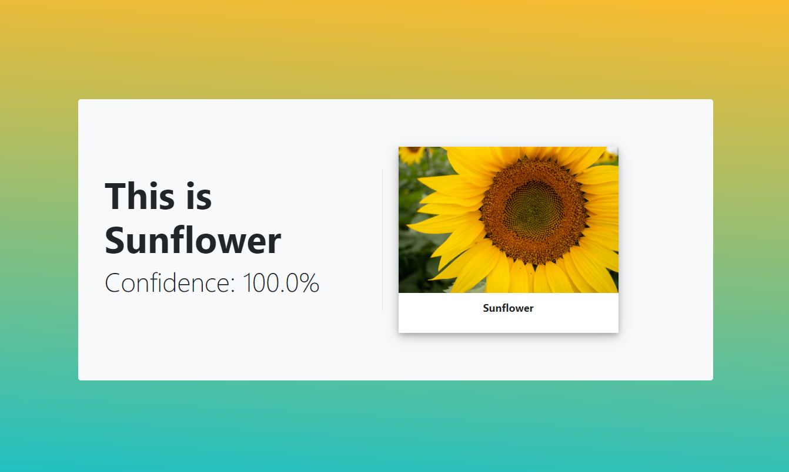
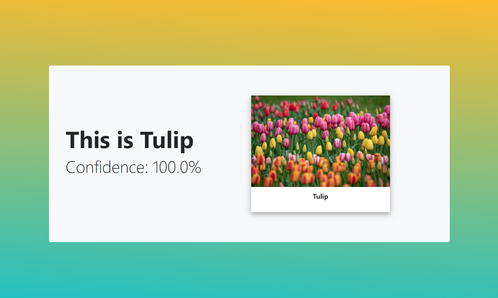

# Flower Images Classification App

Flask app based on a CNN model which recognizes
images of 5 types of flowers:
* Daisy
* Dandelion
* Rose
* Sunflower
* Tulip

The model was trained on this dataset: 
[link](https://www.kaggle.com/datasets/alxmamaev/flowers-recognition).

The process of model training in Google Colab:
[link](https://colab.research.google.com/drive/1_VnFSLx8VenN2lZ9DLtnnMY2-EC8oO4h?usp=sharing).

The model can be downloaded here: 
[link](https://drive.google.com/file/d/1ciU8fawfBAtYkGTjT40fAVoYVt600R1a/view?usp=sharing).

## How to run the app

1. Download the model by the link above.

2. Clone project and create virtual environment.
```shell
git clone https://github.com/yuliia-stopkyna/image-classification-app.git
cd image-classification-app
python -m venv venv
source venv/bin/activate # on MacOS
venv\Scripts\activate # on Windows
pip install -r requirements.txt
```
3. Put the downloaded model file in `static/model` directory inside the project.

4. Run the app.
```shell
flask run
```

## Examples of app pages






